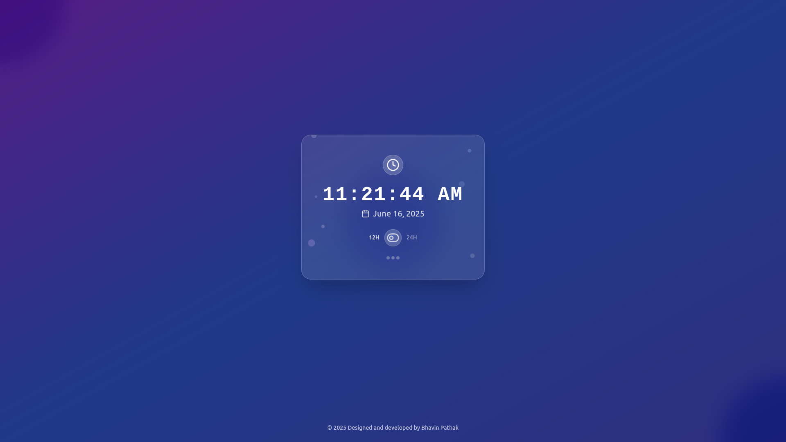

# ⏰ Clocksy

**Clocksy** is a modern, React-based digital clock application designed to provide time-related functionalities with a sleek and responsive user interface.



## ✨ Features

- 🕐 Real-time clock display with customizable time formats 12h/24h
- 📱 Responsive design for desktop and mobile devices

## 📋 Prerequisites

Before you begin, ensure you have the following installed:

- **Node.js** (version 14.0 or higher)
- **npm** (version 6.0 or higher) or **yarn**
- **Git**

## 🚀 Local Setup

1. Clone the repository:

```bash
git clone https://github.com/Bhavin-Pathak/clocksy.git
cd clocksy
```

2. Install dependencies:

```bash
npm install
```

3. Start the development server:

```bash
npm start
```

4. Open `http://localhost:3000` in your browser.

## 📞 Support

If you have any questions or need help, please:

1. Check the [Issues](https://github.com/Bhavin-Pathak/clocksy/issues) page
2. Create a new issue if your problem isn't already reported
3. Contact: bhavinpathak29@gmail.com

## 📄 License

This project is licensed under the MIT License - see the [LICENSE](LICENSE) file for details.

## 🤝 Contributing

1. Fork the repository
2. Create your feature branch (`git checkout -b feature/AmazingFeature`)
3. Commit your changes (`git commit -m 'Add some AmazingFeature'`)
4. Push to the branch (`git push origin feature/AmazingFeature`)
5. Open a Pull Request
6. Follow React best practices
7. Use functional components with hooks
8. Write clean, commented code
9. Add tests for new features
10. Update documentation

## ⭐ If you found this project helpful, please give it a star!
